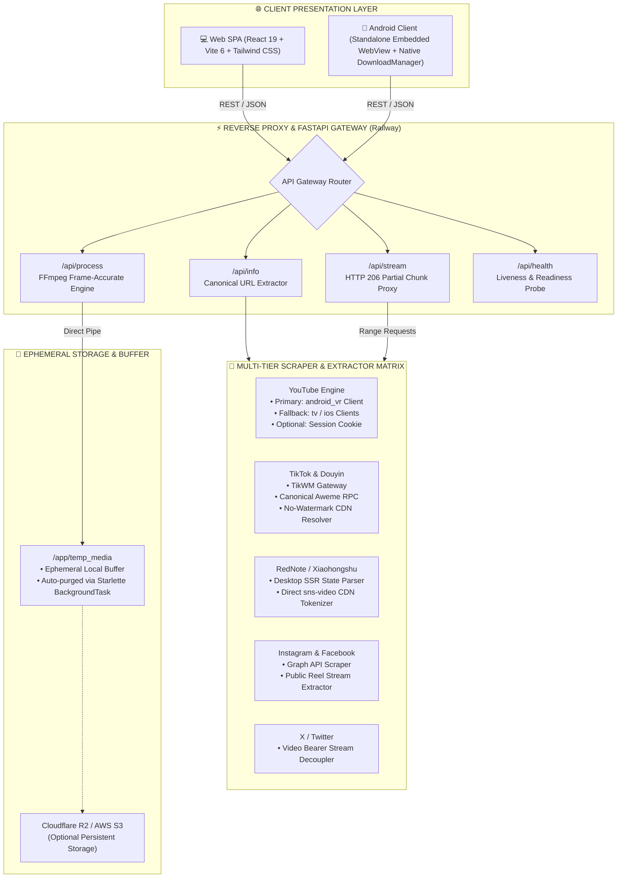

<div align="center">

  

  <br/><br/>

  # ⚡ 𝐎 𝐌 𝐍 𝐈 𝐊 𝐋 𝐈 𝐏
  ### 「 オムニクリップ 」· Next-Gen Universal Media Ingestion & Video Studio
  
  <p align="center">
    <b>Enterprise-grade social media extraction engine, frame-accurate FFmpeg trimmer, and dual-client ecosystem (Vite React 19 + Standalone Android APK).</b>
  </p>

  <p align="center">
    <a href="https://omniklip.vercel.app" target="_blank">
      
    </a>
    <a href="https://github.com/davsite/sosmedify/releases/latest">
      
    </a>
    <a href="https://github.com/davsite/sosmedify/actions">
      
    </a>
    <a href="#-lisensi--kontribusi">
      
    </a>
  </p>

  <!-- Tech Stack Shields -->
  <p align="center">
    
    
    
    
    
    
    
    
    
  </p>

  <!-- Quick Nav -->
  <p align="center">
    <a href="#-keunggulan-arsitektur">Keunggulan</a> •
    <a href="#-sistem-arsitektur">Arsitektur</a> •
    <a href="#-matriks-dukungan-7-platform">Platform Matrix</a> •
    <a href="#-rest-api-reference">REST API</a> •
    <a href="#-aplikasi-android-apk">Android APK</a> •
    <a href="#-panduan-deployment-production">Deployment</a> •
    <a href="#-panduan-lokal-development">Local Dev</a>
  </p>

  <hr style="border: 0; height: 1px; background: linear-gradient(to right, transparent, #F43F5E, #8B5CF6, #06B6D4, transparent); margin: 28px 0;" />

</div>

---

## 🌟 Keunggulan Arsitektur • Key Capabilities

<table>
  <tr>
    <td width="50%" valign="top">
      <h3>🚀 Zero-Watermark Extraction</h3>
      <p>Mengambil berkas video mentah beresolusi penuh tanpa watermark dari <b>TikTok</b> dan <b>Douyin</b> menggunakan jalur API Aweme RPC & TikWM Gateway berkecepatan tinggi.</p>
    </td>
    <td width="50%" valign="top">
      <h3>🛡️ Cloud Datacenter Anti-Bot Bypass</h3>
      <p>Menerapkan strategi fallback klien multi-tier <code>android_vr</code> & <code>ios</code> pada <b>YouTube</b> untuk menembus proteksi <i>"Sign in to confirm you're not a bot"</i> di server cloud Railway/Docker.</p>
    </td>
  </tr>
  <tr>
    <td width="50%" valign="top">
      <h3>⏱️ Frame-Accurate Precision Trimming</h3>
      <p>Pemotong klip instan dengan akurasi milidetik berbasis <b>FFmpeg 7.x stream proxy</b>. Proses pemotongan rata-rata selesai dalam waktu <code>< 1.2 detik</code> tanpa membebani memori server.</p>
    </td>
    <td width="50%" valign="top">
      <h3>⚡ RedNote Direct CDN Ingestion (0.3s)</h3>
      <p>Mengekstrak video dari <b>Xiaohongshu (RedNote)</b> secara langsung melalui parser SSR Desktop State & token CDN <code>sns-video</code> tanpa perlu menjalankan browser headless yang lambat.</p>
    </td>
  </tr>
  <tr>
    <td width="50%" valign="top">
      <h3>🎵 Lossless Audio & Format Selector</h3>
      <p>Konversi langsung ke format <b>MP4 Video</b> (hingga 1080p Full HD) atau ekstraksi <b>MP3 Audio 320kbps High-Bitrate</b> dengan penyesuaian sampling rate otomatis.</p>
    </td>
    <td width="50%" valign="top">
      <h3>📱 Dual Client Ecosystem</h3>
      <p>Tersedia dalam dua antarmuka terpadu: <b>Web Application</b> modern berbasis React 19 + Vite 6 dan <b>Aplikasi Android Standalone</b> dengan aset tertanam lokal <i>(0s initial load)</i>.</p>
    </td>
  </tr>
</table>

---

## 🏗️ Sistem Arsitektur • System Architecture

OmniKlip menggunakan pola arsitektur *decoupled microservice* yang mengisolasi antarmuka klien, gateway streaming berkinerja tinggi, dan orkestrasi pemrosesan FFmpeg:



---

## ⛩️ Matriks Dukungan 7 Platform • Platform Matrix

| Platform | Pola URL (Regex Support) | Engine Ekstraksi | Mekanisme Bypass | Output Resolusi | Watermark | Audio Output |
| :--- | :--- | :--- | :--- | :---: | :---: | :---: |
| **TikTok** | `tiktok.com`, `vm.tiktok.com`, `vt.tiktok.com` | TikWM Gateway + yt-dlp | Mobile UA Spoofing & Redirect Resolver | 1080p | ❌ Bersih | MP3 320k |
| **Douyin** | `douyin.com`, `v.douyin.com`, `iesdouyin.com` | TikWM Aweme RPC & Canonical Page | Mobile Session Emulation | 1080p | ❌ Bersih | MP3 320k |
| **Instagram** | `instagram.com/(reel\|p\|tv)/` | Graph Video Stream Decoupler | Multi-Cookie Session Rotator | 1080p | ❌ Bersih | MP3 320k |
| **Facebook** | `facebook.com`, `fb.watch`, `fb.com` | Direct Watch & Public Reels Parser | Desktop SSR Tokenizer | 1080p | ❌ Bersih | MP3 320k |
| **X / Twitter** | `x.com`, `twitter.com` | Video CDN Token Parser | Direct Stream Decoupler | 1080p | ❌ Bersih | MP3 320k |
| **RedNote** | `xiaohongshu.com`, `xhslink.com` | Desktop SSR & Direct CDN Extractor | 0.3s Fast Stream Tokenizer | 1080p | ❌ Bersih | MP3 320k |
| **YouTube** | `youtube.com/watch`, `youtu.be`, `shorts` | yt-dlp Innertube Engine | Anti-Bot `android_vr` Client Bypass | 4K / 1080p | ❌ Bersih | MP3 320k |

---

## 📡 REST API Reference

Semua respons API menggunakan standar JSON terstruktur dan mendukung CORS universal.

<details open>
<summary><b>1. POST /api/info — Ekstraksi Metadata & Stream URL</b></summary>
<br/>

Menganalisis link media sosial, mengurai link pendek (*shortlinks*), dan mengembalikan metadata lengkap beserta daftar resolusi video yang tersedia.

* **Endpoint**: `/api/info`
* **Method**: `POST`
* **Header**: `Content-Type: application/json`

**Request Payload:**
```json
{
  "url": "https://vt.tiktok.com/ZSjXexample/"
}
```

**Response (200 OK):**
```json
{
  "status": "success",
  "data": {
    "title": "OmniKlip Video Showcase",
    "duration": 48.5,
    "thumbnail": "https://p16-sign.tiktokcdn.com/...jpg",
    "direct_url": "https://v16-webapp-prime.tiktokcdn.com/...mp4",
    "qualities": [
      { "label": "1080p Full HD", "height": 1080 },
      { "label": "720p HD", "height": 720 },
      { "label": "480p SD", "height": 480 },
      { "label": "360p SD", "height": 360 }
    ],
    "platform": "tiktok"
  }
}
```
</details>

<details>
<summary><b>2. GET /api/stream — Universal Streaming Video Proxy (HTTP 206)</b></summary>
<br/>

Menyediakan tunneling CORS dan mendukung *HTTP 206 Partial Content* dengan range requests. Fitur ini memungkinkan pengguna melihat preview video secara instan di filmstrip sebelum memotong video tanpa harus menunggu seluruh video terunduh.

* **Endpoint**: `/api/stream`
* **Method**: `GET`
* **Query Params**: `url=<encoded_direct_url>`
* **Header**: `Range: bytes=0-1048576`

**Contoh cURL:**
```bash
curl -I -X GET "https://convertallsosmed-production.up.railway.app/api/stream?url=https%3A%2F%2Fcdn.example.com%2Fvideo.mp4" \
  -H "Range: bytes=0-1048576"
```
</details>

<details>
<summary><b>3. POST /api/process — Pemotongan Klip & Konversi Format</b></summary>
<br/>

Menjalankan subproses pemotongan presisi (*frame-accurate trim*) dan konversi format ke MP4 Video atau MP3 Audio (320kbps) dengan encoding hardware/fast-preset.

* **Endpoint**: `/api/process`
* **Method**: `POST`
* **Header**: `Content-Type: application/json`

**Request Payload:**
```json
{
  "url": "https://www.instagram.com/reel/CxExample/",
  "start_time": 5.0,
  "end_time": 18.5,
  "format": "mp4",
  "resolution": "1080"
}
```

**Response**: Berkas biner media langsung terunduh via streaming attachment dengan nama berkas `OmniKlip_00-05_00-18.mp4`.
</details>

<details>
<summary><b>4. GET /api/health — Liveness & Readiness Probe</b></summary>
<br/>

Digunakan oleh monitor infrastruktur (Railway, Docker health check, atau Uptime monitoring).

```json
{
  "status": "HEALTHY",
  "app_name": "OmniKlip Converter Service",
  "redis_broker": "CONNECTED",
  "s3_storage_configured": false
}
```
</details>

---

## 📱 Aplikasi Android (APK) • Mobile Client

OmniKlip dilengkapi aplikasi native Android dalam folder [`android-app/`](android-app/) dengan arsitektur **Standalone Embedded Client**:

```
📱 Perangkat Android Pengguna
   │
   ▼
[ Android Standalone Native App (MainActivity.java) ]
   ├── ⚡ Embedded Local Assets (WebViewAssetLoader)
   │     └── assets/web/index.html (React 19 + Vite JS + CSS) — Pemuatan instan 0 detik
   ├── 🔄 SwipeRefreshLayout (Pull-to-Refresh & Re-render)
   ├── 🛡️ Back Button Navigation Handler (Double-press exit protection)
   ├── 📥 Native DownloadListener ──► Android DownloadManager
   │                                  └── Simpan langsung ke /sdcard/Download
   └── ☁️ Background Cloud Media Engine ──► Railway FastAPI
                                              └── yt-dlp & FFmpeg 7.x
```

### 📥 Unduh Berkas APK Siap Pakai

| Berkas | Versi | Ukuran | Status Keamanan | Unduhan |
| :--- | :---: | :---: | :---: | :---: |
| **`omniklip-v1.0.0.apk`** | `v1.0.0` | **~7 MB** |  | [**⬇️ Unduh APK Langsung**](https://github.com/davsite/sosmedify/releases/download/v1.0.0/omniklip-v1.0.0.apk) |
| **GitHub Releases** | `Semua` | - |  | [**🌐 Kunjungi Releases**](https://github.com/davsite/sosmedify/releases) |

> [!TIP]
> **Keunggulan Aset Tertanam (*Offline-Ready UI*)**:
> Seluruh antarmuka React 19 tersimpan langsung di dalam berkas APK. Saat dibuka, aplikasi langsung muncul tanpa menunggu koneksi internet memuat aset web. Komunikasi scraping dan konversi media tetap berjalan cepat melalui backend cloud Railway.

---

## 🏮 Panduan Deployment Production

### 1. Deploy Backend ke Railway (Docker Container)
1. Buka [Railway.app](https://railway.app) dan hubungkan akun GitHub Anda.
2. Klik **New Project** → **Deploy from GitHub repo** → pilih repository ini.
3. Railway otomatis mendeteksi [`railway.json`](railway.json) dan membangun container dari [`Dockerfile`](Dockerfile):
   - Port default: `8080`.
   - Healthcheck path: `/api/health`.
4. Masuk ke menu **Settings** → **Networking** → klik **Generate Domain** (misal: `https://convertallsosmed-production.up.railway.app`).

### 2. Deploy Frontend ke Vercel (Edge Network)
1. Buka [Vercel](https://vercel.com) dan impor repository Anda.
2. Konfigurasi build project:
   - **Framework Preset**: `Vite`
   - **Root Directory**: `frontend`
   - **Build Command**: `npm run build`
   - **Output Directory**: `dist`
3. Masukkan **Environment Variable**:
   ```env
   VITE_API_URL=https://convertallsosmed-production.up.railway.app
   ```
4. Klik **Deploy**. Webapp Anda langsung aktif secara global di Vercel Edge CDN!

---

## ⚙️ Konfigurasi Environment Variables

| Variabel | Kategori | Wajib | Nilai Default | Deskripsi |
| :--- | :---: | :---: | :---: | :--- |
| `PORT` | Backend | Tidak | `8080` | Port listen server FastAPI container. |
| `DEBUG` | Backend | Tidak | `false` | Mode debug & verbose logging. |
| `VITE_API_URL` | Frontend | **Ya** | `http://localhost:8000` | URL endpoint backend Railway (tanpa trailing slash `/`). |
| `YOUTUBE_COOKIES` | Backend | Tidak | `None` | Konten cookies Netscape untuk rotasi sesi YouTube jika dibutuhkan. |
| `PROXIES` | Backend | Tidak | `[]` | JSON array proxy HTTP/SOCKS5 untuk rotasi alamat IP scraper. |
| `S3_ENDPOINT_URL` | Storage | Tidak | `None` | Endpoint URL Cloudflare R2 / AWS S3 (opsional). |
| `S3_ACCESS_KEY` | Storage | Tidak | `None` | Access Key ID kredensial S3. |
| `S3_SECRET_KEY` | Storage | Tidak | `None` | Secret Key kredensial S3. |
| `S3_BUCKET_NAME` | Storage | Tidak | `None` | Nama bucket S3/R2 tujuan upload permanen. |

---

## 💻 Panduan Lokal Development

### Prasyarat
* **Python**: 3.11 atau lebih baru
* **Node.js**: 18.x atau lebih baru (disarankan Node 20 LTS)
* **FFmpeg**: 6.0+ terpasang di PATH sistem

### 1. Menjalankan Backend
```bash
# Pindah ke direktori backend
cd backend

# Buat & aktifkan virtual environment
python -m venv venv
source venv/bin/activate   # Linux/Mac
# .\venv\Scripts\activate  # Windows

# Instal pustaka dependensi
pip install -r requirements.txt

# Jalankan server FastAPI dengan auto-reload
uvicorn main:app --host 0.0.0.0 --port 8000 --reload
```
Akses Swagger UI dokumentasi API di: `http://localhost:8000/docs`.

### 2. Menjalankan Frontend
```bash
# Buka terminal baru dan masuk ke frontend
cd frontend

# Instal paket dependensi
npm install

# Jalankan server Vite development
npm run dev
```
Buka browser di: `http://localhost:5173`.

---

## 🔒 Keamanan & Manajemen Sumber Daya

- **Pembersihan Berkas Otomatis**: Berkas sementara di `/app/temp_media` diproses menggunakan Starlette `BackgroundTask` dan langsung dihapus setelah pengiriman selesai ke pengguna (*zero disk leak*).
- **Sanitasi Parameter Input**: Parameter waktu pemotongan dan resolusi divalidasi ketat menggunakan Pydantic v2 untuk mencegah *command injection* pada subproses FFmpeg.
- **Wadah Iklan Terisolasi**: Banner monetisasi Adsterra dimuat dalam sandbox `iframe srcDoc` terisolasi sehingga tidak dapat memblokir interaksi UI atau mengakses token pengguna.

---

## 📄 Lisensi & Hak Cipta

Proyek ini dirilis di bawah lisensi terbuka [MIT License](LICENSE).  
Bebas digunakan, dikembangkan, dan dimodifikasi untuk kebutuhan personal maupun komersial.

<div align="center">

  <br/>
  <p>🍃 <i>Dibuat dengan presisi tinggi, dedikasi penuh, dan arsitektur yang tangguh.</i> 🌸</p>
  <p><strong>OmniKlip by Dav'site</strong> • © 2026</p>

  

</div>
